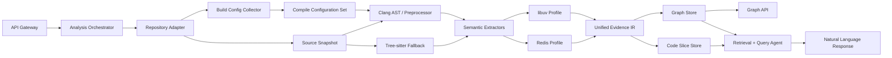
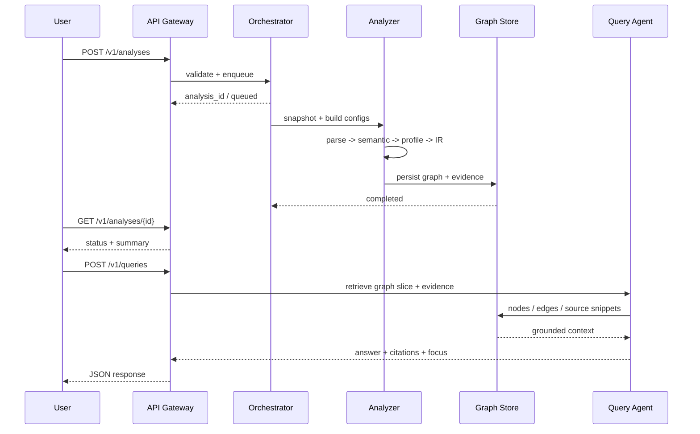

# libuv / Redis 代码逆向 Agent 架构设计

## 1. 目标与边界

本设计面向两个真实 C/C++ 目标仓库：

- libuv：<https://github.com/libuv/libuv>
- Redis：<https://github.com/redis/redis>

系统的目标不是重新实现编译器，而是把静态分析、构建配置和自然语言解释组织成一个可追溯的逆向分析服务：

1. 自动识别模块、入口函数和关键生命周期。
2. 生成直接调用、函数指针、虚调用、异步回调和宏分支关系。
3. 对每条结论保留源码位置、构建配置、推断方法和置信度。
4. 让用户可以围绕一个调用链提问，而不是把整个仓库塞进模型上下文。

第一阶段只承诺 C/C++，优先覆盖 Linux/macOS 构建配置；Windows、交叉编译和完整模板实例化作为后续配置加入。

## 2. 总体架构



### 2.1 组件职责

| 组件 | 责任 | 主要输出 |
| --- | --- | --- |
| API Gateway | 鉴权、请求校验、版本协商、限流 | HTTP/JSON |
| Analysis Orchestrator | 排队、取消、重试、阶段状态和进度 | `analysis.status` |
| Repository Adapter | 识别 Git、工作区和源码快照 | 仓库元数据、文件清单 |
| Build Config Collector | 读取 `compile_commands.json`、CMake、Makefile、Bazel 和环境变量 | 配置集合 |
| Clang/预处理层 | 生成 AST、宏展开、条件分支和源码位置映射 | 原始符号事实 |
| Tree-sitter Fallback | 编译参数缺失时提供增量语法分析 | 降级符号事实 |
| Semantic Extractors | 解析调用、points-to、虚派发、线程和事件模型 | 候选关系 |
| Domain Profiles | 识别 libuv/Redis 的框架语义和回调注册点 | 高置信度关系 |
| Unified Evidence IR | 统一节点、边、证据、配置和置信度 | 分析结果 |
| Graph Store | 按分析版本保存可分页的节点和边 | 图查询 |
| Query Agent | 基于图切片和证据回答问题 | 引用式答案 |

当前 demo 用内存字典和轻量正则分析器替代 Graph Store、Clang 和队列；接口形状保持一致，后续可以逐层替换。

## 3. 分析生命周期



分析状态只允许按以下顺序迁移：

```text
queued -> preparing -> parsing -> indexing -> completed
                         └-----------------> failed
queued/preparing/parsing/indexing ----------> cancelled
```

`completed`、`failed` 和 `cancelled` 是终态。每次重跑都会产生新的 `analysis_id`，不会覆盖旧图。

## 4. libuv 领域适配

libuv 的关键不是普通的函数调用数量，而是“事件注册点 -> loop 调度 -> handle/request 回调”的生命周期。Profile 应优先识别下列语义对象：

| 语义对象 | 识别线索 | IR 映射 |
| --- | --- | --- |
| event loop | `uv_loop_t`、`uv_loop_init`、`uv_run`、`uv_stop` | `event_loop` 节点 |
| handle | `uv_handle_t` 及其派生结构、`uv_*_start` | `handle` 节点、`registers` 边 |
| request | `uv_req_t`、`uv_*_init`、`uv_*_start` | `request` 节点 |
| I/O poll | `uv__io_poll`、backend poll 实现 | `scheduler` 节点 |
| callback | `uv_read_cb`、`uv_write_cb`、`uv_close_cb` 等 typedef | `callback` 节点和 `callback_registers` 边 |
| loop phase | `uv__run_pending`、`uv__run_idle`、`uv__run_prepare`、`uv__run_check`、`uv__run_closing_handles` | `phase` 节点 |

典型链条应表达为：

```text
uv_read_start
  -> uv__io_poll
  -> uv__stream_io
  -> read_cb
  -> user continuation
```

边类型建议：

- `registers_callback`：API 把函数指针写入 handle/request 或 watcher。
- `scheduled_by`：poll、pending queue、prepare/check/idle 阶段触发回调。
- `invokes_callback`：调度函数实际解引用并调用回调。
- `owns_lifecycle`：loop/handle/request 的 init、start、stop、close 关系。

不能把所有带有 `uv_` 前缀的调用都认定为异步关系。只有发现 callback typedef、结构体字段、函数指针参数或已知调度器语义时，才创建 `callback`/`async` 边。

## 5. Redis 领域适配

Redis 默认使用自己的 `ae` 事件库；Redis 与 libuv 的关系必须由源码证据确认，不能在没有 include、构建配置或调用边的情况下假设 Redis 直接依赖 libuv。Profile 需要同时覆盖 Redis 主仓库中的事件循环和可选适配层：

| 语义对象 | 识别线索 | IR 映射 |
| --- | --- | --- |
| event loop | `aeEventLoop`、`aeMain`、`aeProcessEvents` | `event_loop` 节点 |
| file event | `aeFileEvent`、`aeCreateFileEvent`、`aeDeleteFileEvent` | `io_watcher` 节点 |
| time event | `aeTimeEvent`、`aeCreateTimeEvent`、`aeDeleteTimeEvent` | `timer` 节点 |
| file callback | `aeFileProc`、`rfileProc`、`wfileProc` | `callback` 节点 |
| time callback | `aeTimeProc`、`serverCron` | `callback`/`timer` 节点 |
| finalizer | `aeEventFinalizerProc` | `lifecycle` 边 |
| server entry | `main`、`initServer`、`aeMain` | `entry_point`、`owns_lifecycle` |
| module entry | `RedisModule_OnLoad`、module command registration | `module` 和 `registers_callback` |

典型 Redis 链条应表达为：

```text
aeCreateFileEvent
  -> aeProcessEvents
  -> beforesleep / fileProc
  -> readQueryFromClient
  -> processCommand
  -> call()
```

时间事件则类似：

```text
aeCreateTimeEvent
  -> processTimeEvents
  -> serverCron
  -> activeExpireCycle / replicationCron / module callbacks
```

Profile 还要记录以下事实：

- Redis 使用何种 backend（`epoll`、`kqueue`、`evport`、`select`）。
- 文件事件读写 callback 是否分别注册。
- `serverCron` 的周期、返回值和下一次调度时间。
- 模块 API 是否通过函数表或动态符号注册命令。
- 是否存在 hiredis、libuv adapter 或第三方 event loop；这类关系必须标为 `observed` 并提供 include/build 证据。

## 6. 统一 Evidence IR

### 6.1 节点

节点使用稳定的 `node_id`，由 `snapshot_id + kind + qualified_name + location` 哈希得到。最低节点类型：

```text
repository, module, file, function, method, type, variable,
macro, event_loop, handle, request, callback, scheduler,
io_watcher, timer, phase, entry_point
```

### 6.2 边

边至少包含：

```text
edge_id, source, target, type, semantics, confidence,
resolution, evidence[], configurations[], first_seen, last_seen
```

推荐的 `resolution`：

- `observed`：AST、编译器或运行时轨迹直接观察到。
- `inferred`：points-to、命名约定或 domain profile 推断。
- `unresolved`：发现调用或注册点，但目标无法唯一解析。

### 6.3 置信度

置信度不是模型主观评分，而是可解释的加权结果：

```text
confidence = 0.45 * compiler_fact
           + 0.25 * type_fact
           + 0.20 * domain_fact
           + 0.10 * runtime_fact
```

缺失项为 0；若有运行时轨迹，可以将对应权重提升到 0.35 并重新归一化。UI 必须同时显示 `confidence` 和 `resolution`，不能只显示颜色。

## 7. 构建配置与宏

一次仓库分析可以包含多个 `configuration_id`：

```text
linux-debug
linux-release
macos-debug
```

每个配置保存编译器、目标三元组、include 路径、定义和编译参数。关系和宏分支带 `configurations`：

- 仅出现在一个配置：`conditional`。
- 多个配置都出现：`common`。
- 同一位置在不同配置指向不同目标：`variant`。

libuv 的平台 backend 和 Redis 的事件 backend 都必须通过配置维度建模，不能把 `#ifdef` 分支粗暴合并成一条边。

## 8. 查询切片策略

自然语言查询的执行顺序固定为：

1. 解析意图：入口链、回调、函数指针、宏、模块或指定符号。
2. 从 focus 节点向前/向后扩展 1-3 跳。
3. 加入相关配置、注册点、调度点和最多 8 条源码证据。
4. 先由图算法生成候选结论，再由模型组织语言。
5. 输出引用和不确定性；没有证据时明确回答“未解析”。

Agent 禁止直接把整个仓库内容放入 prompt，也禁止把 `unresolved` 边写成确定事实。

## 9. 存储与部署建议

### Demo

- 分析结果：进程内字典。
- 图：单个 JSON 文档。
- 查询：本地规则解释器。
- 目标：展示闭环和接口形状。

### 可用版本

- PostgreSQL/SQLite：分析元数据、节点、边和证据索引。
- 对象存储：源码快照和预处理产物。
- Redis Streams：分析任务队列、进度事件和取消信号。
- Worker：按仓库和配置隔离执行，CPU/内存/超时配额独立。
- LLM Gateway：只接收检索切片，记录 prompt 版本和模型版本。

这里的 Redis 是任务编排或缓存组件时，属于部署依赖；被分析的 Redis 源码则通过 `repository.kind=redis` 的 domain profile 处理。两者在接口中必须区分。

## 10. 风险与验收标准

- 宏、模板和跨翻译单元不完整时，必须返回 `limitations`，不能静默成功。
- 同一符号在多个配置中含义不同时，图查询必须能按配置过滤。
- 异步链至少能区分“注册、调度、回调执行”三类边。
- 每条图边都能跳回文件、行号和证据文本。
- `libuv` 样例验收：loop、handle/request、poll、callback 链可见。
- `redis` 样例验收：ae file event、time event、`aeProcessEvents` 和 `serverCron` 链可见。
- 查询响应即使没有确定目标，也必须返回空 focus、未解析原因和证据。

