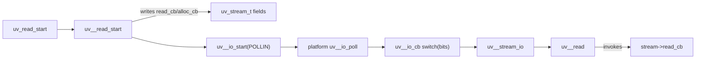

# libuv / Redis 双目标源码结构剖析

> 目标：为代码分析专项 SubAgent 建立可复核的源码知识底座，而不是只生成普通函数调用图。  
> 证据策略：`observed` 结论必须绑定本地 Git commit 与 `file:line`；缺少源码时标为 `pending_snapshot`，不得伪装成实测结果。

## 1. 当前证据状态

| 目标 | 本地源码 | 固定版本 | 当前结论等级 | 复现方式 |
| --- | --- | --- | --- | --- |
| libuv | `../libuv` | `e43e3d8a464ddb5ce2ac24f4db780db747691a7b`，`v1.x` | `observed` | `python3 research/collect_source_metrics.py` |
| Redis | `../redis` 尚未取得 | 待固定 | `pending_snapshot` | 放置官方 checkout 后运行同一命令 |

这一区分很重要：Redis 在本课题中首先是**被分析的第二个开源仓库**，不是默认假设的任务队列或缓存依赖。部署层是否使用 Redis，应另行决策，不能与 `repository.kind=redis` 混为一谈。

## 2. 双目标为什么互补

libuv 能验证底层 C 事件库的难题：跨平台后端、handle/request 生命周期、回调字段、整数回调 ID 和线程池回送。Redis 能验证大型应用层 C 仓库的难题：事件循环上的协议处理、命令元数据分发、持久化、复制、后台任务以及模块函数表。

```text
libuv: API -> handle/request -> scheduler -> callback
Redis: socket event -> client parser -> command metadata -> implementation
                         \-> persistence / replication / module side effects
```

两个仓库必须分别建图。Redis 默认事件库是 `ae`；除非出现 include、链接参数或适配层源码证据，不得生成“Redis 依赖 libuv”的边。

## 3. libuv 仓库结构

### 3.1 分层地图

| 层 | 关键路径 | 职责 | SubAgent 要抽取的事实 |
| --- | --- | --- | --- |
| 公共 API/ABI | `include/uv.h`、`include/uv/*.h` | 类型、回调 typedef、handle/request 字段 | 宏展开字段、继承式布局、回调签名 |
| 公共实现 | `src/uv-common.c`、`src/timer.c`、`src/threadpool.c` | 参数校验、timer、线程池 | API 入口、注册边、跨线程完成边 |
| Unix 核心 | `src/unix/core.c`、`src/unix/loop.c` | loop 阶段、watcher、通用 Unix 生命周期 | 阶段顺序、队列、I/O 分发 |
| Unix 流/网络 | `src/unix/stream.c`、`tcp.c`、`udp.c`、`pipe.c` | stream、accept、read/write、UDP | watcher 到具体 handle 的恢复 |
| Unix 后端 | `linux.c`、`kqueue.c`、`aix.c`、`os390.c`、`posix-poll.c`、`sunos.c` | `uv__io_poll` 平台实现 | 条件配置到唯一实现的绑定 |
| Windows | `src/win/*` | IOCP 等独立实现 | 与 Unix 分区的配置图 |
| 验证 | `test/*` | API 和边界行为 | 黄金问题、动态轨迹入口 |

### 3.2 事件循环骨架

`src/unix/core.c:427` 定义 `uv_run`。主循环的 observed 顺序为：

```text
uv__run_pending
 -> uv__run_idle
 -> uv__run_prepare
 -> uv__io_poll
 -> uv__run_pending (最多 8 次，避免 write callback 饥饿)
 -> uv__run_check
 -> uv__run_closing_handles
 -> uv__update_time
 -> uv__run_timers
```

证据在 `src/unix/core.c:445-480`。`uv__backend_timeout` 同时读取 active handle/request、pending/idle 队列、closing handles 和下一个 timer，因此“是否阻塞 poll”也是 loop 状态机的一部分，不能压扁成普通调用边。

### 3.3 I/O watcher 的非典型分发

`uv__io_t` 定义在 `include/uv/unix.h:90`。当前版本没有在 watcher 中保存普通函数指针，而把回调类别编码到 `bits` 低 4 位：

```text
src/unix/internal.h:264-276  uv__io_cb_t 枚举
src/unix/internal.h:278      uv__io_cb_get(w) = bits & 15
src/unix/internal.h:279-283  uv__io_cb_set(w, cb)
src/unix/core.c:906-937      switch -> 具体 I/O handler
```

因此 points-to 分析还不够。Profile 必须执行：枚举常量传播 -> `bits` 写入/读取关联 -> `switch` case 目标解析 -> 配置过滤。否则 `uv__io_poll -> uv__stream_io` 等核心边会丢失。

### 3.4 TCP 读取完整链



关键证据：

- API 委托：`src/uv-common.c:1068-1088`；
- callback 字段来自宏展开：`include/uv.h:520-537`；
- 注册和启动 watcher：`src/unix/stream.c:1495-1512`；
- poll 后的类型分发：`src/unix/core.c:906-937`；
- I/O handler：`src/unix/stream.c:1198-1246`；
- 用户 read callback：`src/unix/stream.c:1153`。

建议 IR 边序列：`direct -> writes -> registers_callback -> scheduled_by -> dispatches -> invokes_callback`。只生成 `uv_read_start -> read_cb` 会丢失时序、线程和证据含义。

### 3.5 TCP 监听完整链

```text
uv_listen
 -> uv__tcp_listen
 -> tcp->connection_cb = cb
 -> uv__io_cb_set(UV__SERVER_IO)
 -> uv__io_start(POLLIN)
 -> platform uv__io_poll
 -> uv__io_cb
 -> uv__server_io
 -> stream->connection_cb(stream, 0)
```

证据：`src/unix/stream.c:598-619`、`src/unix/tcp.c:421-449`、`src/unix/stream.c:507-531`。其中 `container_of(w, uv_stream_t, io_watcher)` 是从 watcher 恢复 owner 的关键数据流事实。

### 3.6 Timer 链

`uv_timer_start` 在 `src/timer.c:67-94` 写入 `handle->timer_cb`，根据 loop time 计算 timeout，并把 timer 放入 heap。`uv__run_timers` 在 `src/timer.c:164` 从最小堆移动到 ready queue 后触发回调。该链要求同时表示：

```text
register callback -> heap schedule -> uv_run timer phase -> invoke callback
```

回调重启 timer 或关闭 handle 时会改变 heap，因此生命周期边和回调边必须共同查询。

### 3.7 线程池链与线程归属

```text
uv_queue_work
 -> req->work_cb / after_work_cb assignment
 -> uv__work_submit(work=uv__queue_work, done=uv__queue_done)
 -> worker thread invokes req->work_cb
 -> completion enters loop->wq
 -> uv_async_send
 -> loop thread uv__work_done
 -> w->done
 -> req->after_work_cb
```

证据集中在 `src/threadpool.c:276-285`、`:319-340`、`:359-395`。这条链必须给节点/边增加 `execution_context=worker|loop`；否则自然语言回答会把 `work_cb` 和 `after_work_cb` 错说成同一线程执行。

### 3.8 Async 跨线程唤醒

`uv_async_init` 在 `src/unix/async.c:72-86` 注册 `async_cb`；发送端只设置 pending 并唤醒 loop；loop 侧 `uv__async_io` 在 `src/unix/async.c:102-159` 原子清 pending 后调用回调。IR 需要保留原子同步或最少记录 `happens_after_wakeup`，不能把 `uv_async_send` 标成同步执行 callback。

### 3.9 宏与平台配置

`UV_REQ_FIELDS`、`UV_HANDLE_FIELDS`、`UV_STREAM_FIELDS` 在 `include/uv.h:432-537` 拼装对象布局；`UV_IO_PRIVATE_PLATFORM_FIELDS` 在平台头文件中扩展 watcher。分析器必须同时保存 spelling location 和 expansion location。

本地快照中 `uv__io_poll` 有六个 Unix 定义。最终图必须按 `configuration_id` 分区；将六条候选边同时展示为一个平台的运行路径属于虚报。

## 4. Redis 源码结构模型

本节给出需要由本地官方快照验证的 profile 和穿刺路径。由于当前没有 `../redis`，以下符号与职责是**分析假设**，状态为 `pending_snapshot`，没有行号，不能作为最终 observed 证据。

### 4.1 预期分层地图

| 层 | 典型路径 | 需要验证的职责 |
| --- | --- | --- |
| 启动与全局状态 | `src/server.c`、`src/server.h` | `main`、配置加载、`initServer`、进入 `aeMain` |
| 事件库 | `src/ae.c`、`src/ae.h`、`src/ae_*.c` | file/time event 与 epoll/kqueue/evport/select backend |
| 网络与协议 | `src/networking.c`、RESP/parser 相关文件 | accept、client、读取 query、回复输出 |
| 命令 | `src/server.c`、生成的 command metadata | lookup、ACL/状态检查、`processCommand`、`call` |
| 数据结构 | `dict.c`、`sds.c`、`adlist.c`、`rax.c`、`quicklist.c`、`listpack.c` | 容器、字符串、索引、内存所有权 |
| 持久化 | `rdb.c`、`aof.c` | RDB fork/save、AOF feed/flush/rewrite |
| 复制与集群 | `replication.c`、`cluster.c` | master/replica 状态机、PSYNC、cluster bus |
| 后台任务 | `bio.c` 及 I/O thread 相关文件 | fsync/free/close 等任务与主线程回送 |
| 模块 | `module.c`、`redismodule.h` | OnLoad、命令注册、函数表和动态 API |

### 4.2 AE 事件循环穿刺

应验证的主链：

```text
main -> initServer -> aeCreateEventLoop
                    -> aeCreateFileEvent(listening/client fd)
                    -> aeCreateTimeEvent(serverCron)
     -> aeMain -> aeProcessEvents -> aeApiPoll
                              |-> fileProc(eventLoop, fd, clientData, mask)
                              \-> timeProc(eventLoop, id, clientData)
```

重点不是符号是否存在，而是：

1. backend 如何通过编译宏选择；
2. `rfileProc` 与 `wfileProc` 是否可为同一函数，防止重复调用；
3. `clientData` 如何把 generic event 恢复为 client/server 对象；
4. before-sleep/after-sleep hooks 位于 poll 前后哪一侧；
5. time callback 的返回值如何决定删除或下次调度。

### 4.3 客户端请求到命令执行

黄金链应从 socket 注册点开始，而不是从 `processCommand` 截断：

```text
acceptTcpHandler
 -> createClient
 -> aeCreateFileEvent(fd, AE_READABLE, readQueryFromClient, client)
 -> aeProcessEvents
 -> readQueryFromClient
 -> query buffer / RESP parser
 -> processInputBuffer
 -> processCommand
 -> command lookup metadata / function pointer
 -> call
 -> concrete command implementation
 -> reply buffering / writable event
```

SubAgent 要恢复三类间接关系：AE callback 字段、命令表中的实现函数指针、clientData 类型恢复。还要把 ACL、事务、集群重定向、OOM/持久化错误等 guard 作为条件边，而不是误认为每个请求必然到达具体 command。

### 4.4 `serverCron` 时间事件

应验证：`initServer` 注册 `serverCron`、`processTimeEvents` 调度它、返回值决定下次触发。`serverCron` 通常再驱动数据库维护、客户端维护、持久化、复制和集群周期任务，因此适合验证“一对多调度 + 条件编译/配置 + 周期状态”的图表达。

### 4.5 持久化和后台任务

需要分别穿刺：

- RDB：请求/定时条件 -> background save -> fork/child save -> parent child-exit handling；
- AOF：命令传播 -> AOF buffer -> flush policy -> fsync/background job；
- rewrite：触发条件 -> child rewrite -> parent 合并/切换文件；
- BIO：enqueue -> worker dispatch -> concrete job -> completion/accounting。

这些链横跨进程或线程。边至少要带 `execution_context=main|child_process|bio_thread` 和 `handoff_kind=fork|queue|signal`。

### 4.6 模块与函数表

模块分析不能只找 `RedisModule_OnLoad`。应继续恢复：API 获取宏/函数表、命令注册、command proxy 到模块函数、事件订阅和卸载清理。宏展开证据需要同时指向模块源码调用处与 `redismodule.h` 定义处。

## 5. 必须生成的双仓 Evidence IR

### 5.1 节点最小集

```text
repository, configuration, module, file, function, type, field, macro,
event_loop, phase, io_watcher, timer, handle, request, callback,
thread, process, queue, command, persistence_job
```

### 5.2 边最小集

```text
direct, reads, writes, contains, expands_to, selected_by_config,
registers_callback, scheduled_by, dispatches, invokes_callback,
resolves_owner, enqueues, dequeues, forks, returns_to_loop,
guards, propagates, unresolved
```

每条确定关系必须有 `resolution`、`confidence`、`configurations` 与至少一条 `evidence`。Redis snapshot 不存在时，API 应返回 `SOURCE_UNAVAILABLE`，不能返回空图加 `completed`。

## 6. Demo 验证矩阵

| 编号 | 目标 | 问题 | 期望关键边 | 当前状态 |
| --- | --- | --- | --- | --- |
| L1 | libuv | `uv_read_start` 如何触发用户回调？ | register/schedule/dispatch/invoke | 可基于本地源码验收 |
| L2 | libuv | Linux 与 macOS 的 poll 实现是否相同？ | config -> unique backend | 可基于本地源码验收 |
| L3 | libuv | `uv_queue_work` 两个回调在哪个线程？ | enqueue/worker/return-to-loop | 可基于本地源码验收 |
| L4 | libuv | timer 如何重复调度？ | heap/phase/invoke/reschedule | 可基于本地源码验收 |
| L5 | libuv | `uv__io_t.bits` 如何决定 handler？ | integer ID/switch dispatch | 可基于本地源码验收 |
| R1 | Redis | socket readable 到 command 实现的链？ | AE callback/parse/table pointer | 等待 snapshot |
| R2 | Redis | `serverCron` 从哪里注册、如何重调度？ | time register/invoke/reschedule | 等待 snapshot |
| R3 | Redis | 当前配置使用哪个 AE backend？ | macro/config -> backend | 等待 snapshot |
| R4 | Redis | AOF fsync 是否进入后台线程？ | buffer/enqueue/BIO | 等待 snapshot |
| R5 | Redis | 模块命令如何从注册到执行？ | API table/register/proxy/invoke | 等待 snapshot |

## 7. 完成标准

“彻底剖析”不能以文档页数判断，应满足：

1. 两个仓库均绑定完整 commit SHA；
2. 每仓至少完成 5 条人工标注黄金链；
3. 每条黄金链覆盖注册、调度、执行和线程/配置边界；
4. 关键函数/宏均可回跳到真实源码行；
5. Demo 的 JSON 通过 Schema 校验，回答引用的边能在图 API 中复现；
6. 缺失配置或歧义目标以 `unresolved` 返回，不通过函数名猜测补齐；
7. 以 20 个问题统计链边召回率、证据准确率和虚报率。

当前项目已达到 libuv 的源码调研基线；Redis 尚缺官方源码快照，因此不能宣称双仓实证完成。`collect_source_metrics.py` 是补齐 Redis 后的第一道可重复门禁。
