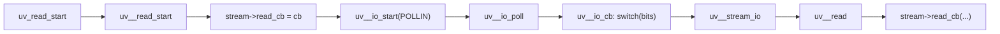
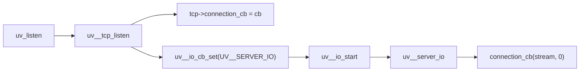
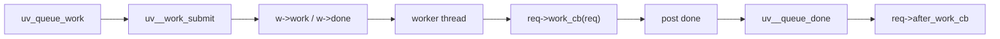

# 基于 libuv 开源大码仓的代码逆向 Agent 课题调研结果

> 调研基准：libuv `v1.x`，commit `e43e3d8`  
> 调研日期：2026-08-20  
> 证据来源：本仓库 `/Users/andye/Documents/New project/libuv` 的源码、头文件与 `build/compile_commands.json`

## 1. 调研结论摘要

libuv 是研究“异步回调链逆向分析”的理想穿刺目标：它规模适中、边界清晰，但完整复现了大型 C 项目中最难自动分析的三种模式：

1. 函数指针回调不通过普通函数调用表达，而是**先注册、后由事件循环间接调度**；
2. 回调函数有时不是函数指针，而是**编码成整型回调 ID，再由 `switch` 分发**；
3. 类型层级、回调字段和平台能力通过**多层宏与条件编译**拼接。

我们用仓库中已有的轻量分析器对 `libuv/src` 做了基线测试：它能识别 1571 个函数和 3006 条直接调用边，但通用解析器的**函数指针边为 0**，而源码中明确存在 27 个回调 typedef 和至少 65 处回调调用点。领域 profile 会在此基础上追加专项语义边，因此总边数以采集脚本当次输出为准。这证明：

- 通用“文本级调用图”不足以支撑逆向分析；
- 正确解是“**编译配置感知的语义分析 + 证据图 + 专项 SubAgent**”；
- 模型应负责解释证据和追问，不应负责凭空推断调用关系。

## 2. 调研对象

### 2.1 libuv 定位

libuv 是 Node.js 使用的跨平台异步 I/O 库，核心对象是：

- `uv_loop_t`：事件循环；
- `uv_handle_t`：带生命周期和关闭回调的句柄；
- `uv_req_t`：异步请求；
- `uv_*_cb`：由用户提供的回调函数。

### 2.2 数据规模

| 指标 | 实测值 |
| --- | --- |
| 当前 commit | `e43e3d8`，分支 `v1.x` |
| `compile_commands.json` 编译单元 | 475 |
| `src` 共享 C 文件 | 12 |
| `src/unix` C 文件 | 50 |
| `src/win` C 文件 | 25 |
| `src/unix` 代码行数 | 25,565 |
| `test` 目录代码行数 | 47,797 |
| `uv.h` 中回调 typedef | 27 |
| 直接回调调用点 | 65 |
| Unix 源码条件编译指令 | 356 |

数据复现方式：

```bash
cd /Users/andye/Documents/New\ project/code_reverse_agent
python3 research/collect_libuv_metrics.py
```

## 3. 研究方法

本次调研采用“源码取证 + 定量基线 + 设计推演”三种方法交叉验证：

1. **源码取证**：从入口 API 出发，人工追踪注册、调度和执行三类事实；
2. **定量基线**：运行现有轻量解析器，测量通用调用图在 libuv 上的召回缺口；
3. **设计推演**：把缺口映射到 Clang AST、points-to、预处理器和 LLM 分层职责。

## 4. 关键发现

### 4.1 事件循环有固定阶段，但不是普通函数图

`uv_run` 的主循环位于 `src/unix/core.c:428-479`。顺序是：

```text
pending -> idle -> prepare -> uv__io_poll -> pending(最多 8 次)
        -> check -> closing handles -> update_time -> timers
```

这说明“运行期路径”不等价于“静态调用图”。直接调用图只能证明 `uv_run` 调用了阶段函数，无法解释某个用户回调何时、由哪个阶段、以什么顺序触发。

### 4.2 回调注册必须单独建模

`uv_read_start` 的注册路径如下：

```text
src/uv-common.c:1068  uv_read_start
src/uv-common.c:1088  uv__read_start
src/unix/stream.c:1507 stream->read_cb = read_cb
src/unix/stream.c:1508 stream->alloc_cb = alloc_cb
src/unix/stream.c:1510 uv__io_start(..., POLLIN)
```

用户回调不是被 `uv_read_start` 直接调用，而是写入 `stream->read_cb` 字段。只有把“字段写入”和“字段解引用”关联起来，才能恢复异步链。

### 4.3 最难的机制：回调 ID 编码 + switch 分发

libuv 的 I/O watcher 不保存函数指针，而是把回调类型编码进 `uv__io_t.bits` 的低 4 位：

```text
include/uv/unix.h:90-98   struct uv__io_s { uintptr_t bits; ... }
src/unix/internal.h:263   enum uv__io_cb_t { UV__NO_IO_CB, ..., UV__UDP_IO }
src/unix/internal.h:278   #define uv__io_cb_get(w) ((w)->bits & 15)
src/unix/core.c:906       void uv__io_cb(...)
src/unix/core.c:907       switch (uv__io_cb_get(w)) {
src/unix/core.c:907-937   按枚举值调用 uv__stream_io / uv__server_io / ...
```

传统函数指针分析假设“变量指向函数地址”。这里的目标函数由 4 位枚举值和 `switch` 表共同决定，需要用**枚举常量传播 + switch 目标解析**补齐。

### 4.4 宏构成类型继承和平台字段

回调字段藏在由宏拼接的结构体里：

```text
include/uv.h:463      #define UV_HANDLE_FIELDS
include/uv.h:479      struct uv_handle_s { UV_HANDLE_FIELDS }
include/uv.h:518      #define UV_STREAM_FIELDS
include/uv.h:534      struct uv_stream_s { UV_HANDLE_FIELDS UV_STREAM_FIELDS }
include/uv/unix.h:85  UV_IO_PRIVATE_PLATFORM_FIELDS
```

如果只分析“未展开源码”，`uv_tcp_t` 的子类关系、`read_cb` 字段和平台私有字段都会丢失。正确入口是**预处理器展开后的 AST + 展开位置映射**。

### 4.5 一次图无法覆盖所有平台

`uv__io_poll` 有 6 个 Unix 后端实现：

```text
aix.c, kqueue.c, linux.c, os390.c, posix-poll.c, sunos.c
```

Windows 还有完全独立的 `src/win` 实现。`uv_run` 调用 `uv__io_poll` 时，目标函数取决于构建配置。因此图必须按“配置图”保存：

- `uv_run -> linux.c:uv__io_poll`（Linux）
- `uv_run -> kqueue.c:uv__io_poll`（macOS）
- `uv_run -> src/win/core.c` 的实现（Windows）

### 4.6 轻量解析器基线与真实需求之间的差距

| 指标 | 基线结果 | 说明 |
| --- | --- | --- |
| 分析文件 | 104 | 覆盖 `src` 与头文件 |
| 识别函数 | 1571 | 函数体匹配召回 |
| 直接调用边 | 3006 | 文本级调用 |
| async 提示边 | 42 | 仅靠函数名猜测 |
| callback 提示边 | 15 | 仅靠函数名猜测 |
| **函数指针边** | **0** | 完全漏掉回调机制 |
| 未解析调用 | 100+ | `container_of`、`strlen` 等宏/外部符号 |
| 分析耗时 | 约 23 秒 | 当前机器重复运行约 22-23 秒，轻量正则方法可接受 |

这组数据明确了产品边界：轻量方法适合“快速概览”，不适合“专家级逆向”。课题的核心指标应围绕**回调注册点和字段解引用点的召回率**定义。

## 5. 三条代表性调用链

### 5.1 TCP 读取：注册 → I/O 事件 → 用户回调



证据：

- `src/uv-common.c:1068-1088`
- `src/unix/stream.c:1497-1513`
- `src/unix/core.c:906-937`
- `src/unix/stream.c:1198-1240`
- `src/unix/stream.c:1153`

### 5.2 TCP 监听：连接回调



证据：`src/unix/tcp.c:421-449`，`src/unix/stream.c:507-527`。

### 5.3 线程池工作项



证据：`src/threadpool.c:276-284`、`src/threadpool.c:359-362`、`src/threadpool.c:330-340`、`src/threadpool.c:379-393`。

## 6. 研究问题与答案

| 研究问题 | 调研答案 |
| --- | --- |
| 能否只靠文本 grep 恢复异步链？ | 不能。`uv__io_t.bits` 分发和字段注册会完全漏掉 |
| 需要完整语义分析吗？ | 需要。至少需要 AST、预处理器记录和字段敏感 points-to |
| 一个调用图够吗？ | 不够。需要按编译配置保存多版本关系 |
| LLM 适合做什么？ | 解释证据、规划检索、提出假设；不适合直接推断跳转目标 |
| 如何验证？ | 用 libuv 测试用例和公开 API 作为黄金问题集，核对文件/行号 |

## 7. 调研产出建议

建议把调研结果固化为三个可执行成果：

1. **证据图 IR**：节点、边、证据、配置、置信度。
2. **专项 SubAgent**：工具驱动的检索-验证-解释循环。
3. **libuv 黄金评测集**：10-20 条回调链问题 + 期望证据位置。

详细方案见 [`subagent-design.md`](subagent-design.md)。
