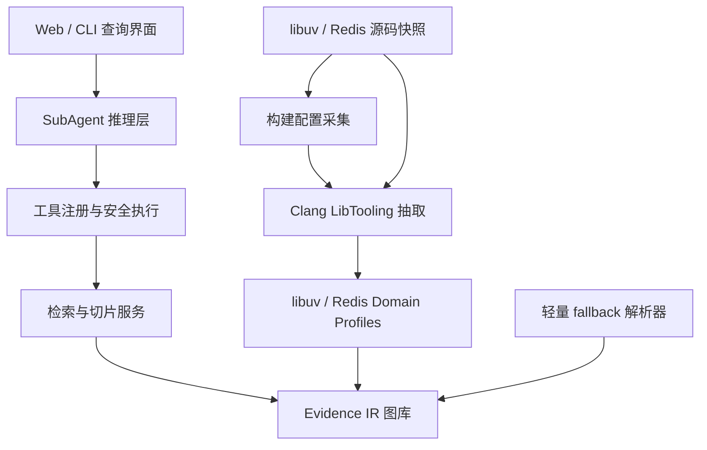
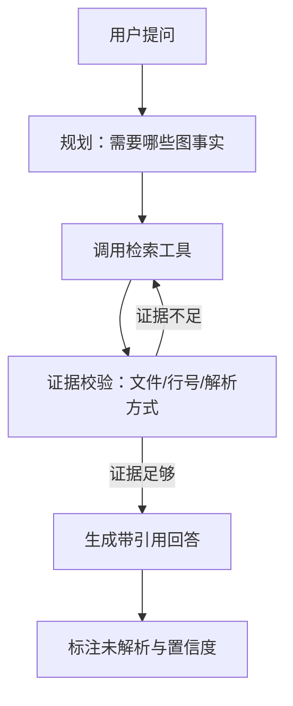

# 代码分析专项 SubAgent 课题设计方案

## 1. 课题定义

### 1.1 课题目标

以 libuv 和 Redis 两个开源 C 大码仓为并列穿刺基准，构建一个**代码分析专项 SubAgent**。libuv 验证底层跨平台异步库，Redis 验证事件驱动应用、命令分发和持久化，目标能力：

1. 自动逆向模块架构；
2. 提取关键函数调用链；
3. 理解异步回调链；
4. 解析函数指针与复杂编译宏；
5. 以专家方式阅读代码；
6. 输出清晰的调用关系图；
7. 所有结论可溯源到源码位置。

### 1.2 非目标

- 不替换编译器，不实现完整 C++ 语义；
- 不把整个仓库塞入 LLM 上下文；
- 不承诺所有函数指针都唯一解析，允许标注未解析；
- 首期不覆盖 Rust/Java/Go。

## 2. 设计原则

1. **证据优先**：每条边必须有 `file:line`、展开证据和解析方法。
2. **静态为主、动态为辅**：首期静态分析；后续可选接入测试轨迹。
3. **配置图分离**：Linux/macOS/Windows 关系分别存储，防止串配置。
4. **模型做解释、工具做事实**：LLM 不直接生成“函数 A 调用了函数 B”的结论。
5. **渐进替换**：现有轻量 demo 保留为 fallback，生产层逐步换成 Clang。

## 3. 系统总体架构



### 3.1 分析流水线

```text
源码 + compile_commands.json
  -> 预处理展开记录
  -> Clang AST
  -> 符号/类型/宏/调用事实
  -> libuv / Redis domain profile
  -> 多配置 Evidence IR
  -> 图库 + 代码切片
```

### 3.2 分层职责

| 层 | 职责 | 不做什么 |
| --- | --- | --- |
| 静态分析层 | 产出节点、边、证据、置信度 | 不回答用户问题 |
| 图检索层 | 图查询、路径展开、切片 | 不生成解释文本 |
| SubAgent 层 | 规划工具调用、验证假设、组织回答 | 不编造跳转关系 |

## 4. Evidence IR

### 4.1 节点

```text
repository / module / file / function
type / variable / macro
event_loop / handle / request / callback
io_watcher / timer / scheduler / entry_point
```

每个节点至少包含：

```json
{
  "node_id": "n_xxx",
  "kind": "function",
  "name": "uv__stream_io",
  "qualified_name": "uv__stream_io",
  "location": {"file": "src/unix/stream.c", "start_line": 1198},
  "configurations": ["darwin-arm64"]
}
```

### 4.2 边

```text
direct              直接调用
virtual             虚调用
function_pointer    函数指针调用
registers_callback  注册用户回调
scheduled_by        事件循环调度
invokes_callback    实际执行回调
owns_lifecycle      生命周期
reads / writes      字段数据流
macro_variant       宏分支关系
unresolved          无法解析目标
```

每条边必须带：

```json
{
  "resolution": "observed | inferred | unresolved",
  "confidence": 0.97,
  "evidence": [
    {"kind": "ast", "file": "src/unix/stream.c", "line": 1507,
     "text": "stream->read_cb = read_cb;"}
  ],
  "configurations": ["darwin-arm64"]
}
```

### 4.3 回调链编码

libuv 的链不能只用一条边表示。对 `uv_read_start`：

```text
uv_read_start -> registers_callback -> stream.read_cb
uv_read_start -> scheduled_by -> uv__io_poll
uv__io_poll -> invokes_callback -> uv__stream_io
uv__stream_io -> invokes_callback -> stream.read_cb
```

查询层把注册边、调度边和执行边串联起来，而不是把回调当成直接调用。

## 5. 双仓专项识别规则

### 5.1 libuv API 规则

识别以下公开 API 及其回调参数：

```text
uv_read_start, uv_write, uv_listen, uv_connect,
uv_queue_work, uv_timer_start, uv_async_init,
uv_poll_start, uv_fs_*, uv_close
```

### 5.2 libuv 内部机制规则

- `uv__io_cb_t` 枚举 → `uv__io_cb` switch 目标；
- `uv__io_t.bits & 15` → 回调 ID 传播；
- `UV_*_FIELDS` 宏 → 结构体字段展开；
- `stream->read_cb / connection_cb / timer_cb` → 注册字段；
- `uv__io_start / uv__io_feed` → 调度事实；
- `uv__stream_io / uv__server_io / uv__run_timers` → 执行事实。

### 5.3 Redis 专项规则

- `aeCreateFileEvent` 写入 `rfileProc` / `wfileProc` 与 `clientData`，`aeProcessEvents` 负责实际调用；
- `aeCreateTimeEvent` 写入 time callback，`processTimeEvents` 根据返回值删除或重调度；
- socket readable 链恢复到 `readQueryFromClient -> processInputBuffer -> processCommand -> call`；
- 命令元数据表中的实现函数指针解析为 `dispatches`，并保留 ACL、事务、集群和内存状态 guard；
- RDB/AOF/BIO 链标注 `main`、`child_process`、`bio_thread` 执行上下文和 fork/queue handoff；
- `RedisModule_OnLoad`、模块命令注册和 API 函数表保留宏展开与动态注册证据；
- 未发现 include、链接参数或适配层证据时，禁止推断 Redis 依赖 libuv。

Redis 规则只有在官方源码快照绑定 commit 后才能输出 `observed`；缺少快照必须返回 `SOURCE_UNAVAILABLE`。

### 5.4 配置与平台规则

为以下配置分别建图：

```text
darwin-arm64 / darwin-x86_64 / linux-x86_64 / win32
```

`uv__io_poll` 的后端选择和 Redis `ae` backend 的选择都必须在每个配置图中独立解析。

## 6. SubAgent 设计

### 6.1 Agent 循环



### 6.2 工具集

| 工具 | 作用 |
| --- | --- |
| `find_symbol` | 按名称找函数/类型/宏 |
| `get_call_edges` | 查询入边/出边 |
| `trace_async_chain` | 串联注册、调度、执行边 |
| `resolve_pointer` | 查函数指针/回调 ID 目标 |
| `read_slice` | 取源码片段及上下文 |
| `query_configuration` | 按平台过滤关系 |
| `report_uncertainty` | 返回未解析调用和低置信度边 |

工具返回统一格式：

```json
{
  "resource_type": "tool_result",
  "schema_version": "1.0",
  "tool_call_id": "tc_01J...",
  "analysis_id": "an_01J...",
  "tool_name": "trace_async_chain",
  "ok": true,
  "result": {
    "result_type": "paths",
    "items": [...]
  },
  "evidence": [...],
  "pagination": {"next_cursor": null, "has_more": false}
}
```

工具调用与返回分别由 `contracts/tool.invoke.schema.json` 和 `contracts/tool.result.schema.json` 校验；`tool_call_id` 必须原样回显，以支持 SubAgent 并发工具调用和审计回放。`ok=true` 时返回 `result`，`ok=false` 时返回 `error`，两者互斥；不确定性由 `report_uncertainty` 工具返回，不能混入所有工具的通用信封。

### 6.3 提示词边界

系统提示要求模型：

- 回答前必须引用图证据；
- 区分 `observed` 和 `inferred`；
- 无证据时明确说“未解析”；
- 禁止用函数名相似性代替跳转目标；
- 关键结论附 `file:line`。

## 7. 输出产品形态

1. **交互式调用图**：节点可点击，边按类型着色，支持平台筛选；
2. **回调链时间线**：注册 → 调度 → 回调执行三阶段可视化；
3. **自然语言报告**：架构总结、函数链、风险与未解析清单；
4. **JSON API**：供 IDE、评测和 CI 使用。

## 8. 评测方案

### 8.1 黄金问题集

从 libuv / Redis 文档、源码和测试用例各抽取至少 10 个问题，组成 20 个双仓黄金问题，例如：

```text
uv_read_start 注册的回调由哪个函数执行？
uv_listen 的 connection_cb 在哪里被调用？
uv_queue_work 的 work_cb 和 after_work_cb 分别在哪执行？
macOS 与 Linux 的 uv__io_poll 是什么关系？
Redis 的 readable socket event 如何到达具体命令实现？
serverCron 在哪里注册，返回值如何控制下一次调度？
当前配置选择了哪个 ae backend？
AOF fsync 是否跨越 BIO 线程边界？
模块命令从 RedisModule_OnLoad 如何到达执行函数？
```

### 8.2 指标

| 指标 | 定义 |
| --- | --- |
| 链召回率 | 恢复出的黄金边 / 人工标注黄金边 |
| 证据准确率 | 回答中的 file:line 与真实源码一致 |
| 虚报率 | 错误或无法验证的关系占比 |
| 未解析透明率 | 应报未解析处是否明确标注 |
| 查询时延 | 从提问到带引用回答的耗时 |

首期目标按仓库分别统计：libuv 与 Redis 的核心链召回率均 ≥ 90%，证据准确率均 ≥ 95%，虚报率均 ≤ 5%。不能用一个仓库的高分抵消另一个仓库的缺口。

## 9. 实施阶段

### 阶段 1：双仓快照与语义事实抽取（1-2 周）

- 固定 libuv / Redis 完整 commit，保存源码清单和构建指纹；
- 接入 `compile_commands.json`；
- Clang LibTooling 导出函数、类型、宏和预处理记录；
- 保留现有轻量分析器作为 fallback。

### 阶段 2：libuv 回调链图谱（2-3 周）

- 字段写入/解引用关联；
- `uv__io_cb_t` 枚举传播；
- `UV_*_FIELDS` 宏展开；
- 多配置图与平台筛选。

### 阶段 3：Redis 事件与命令链图谱（2-3 周）

- `ae` file/time callback 注册、backend 选择和调度；
- socket -> parser -> command table -> command implementation；
- RDB/AOF/BIO 跨进程或线程 handoff；
- 模块命令和 API 函数表。

### 阶段 4：SubAgent 与界面（2-3 周）

- 工具注册、检索切片、Agent 循环；
- 调用图、链时间线、引用式问答；
- JSON API 与评测脚本。

### 阶段 5：双仓评测与优化（1-2 周）

- libuv / Redis 双仓黄金问题集；
- 回溯率、虚报率统计；
- 选择第三个业务仓库检验 domain profile 的可迁移性。

## 10. 风险与对策

| 风险 | 对策 |
| --- | --- |
| Clang 环境不一致 | 以 `compile_commands.json` 为唯一入口，隔离环境 |
| 宏展开丢失映射 | 使用 `MacroExpansion`/`ExpansionLoc` 记录展开位置 |
| 函数指针无法唯一解析 | 保留多目标，标注 `inferred` 与置信度 |
| 平台图爆炸 | 只生成目标配置，图按配置分区 |
| LLM 编造关系 | 工具强制返回证据，评测虚报率并设阈值 |
| 模型上下文过大 | 图切片 + 边分页，不整仓注入 |

## 11. 与现有 demo 的关系

现有 `code_reverse_agent` 保留为：

- 离线可演示闭环；
- 接口契约与 UI 原型；
- 轻量 fallback 解析器。

生产实现替换分析层，不改 SubAgent 交互和 IR 边界。
